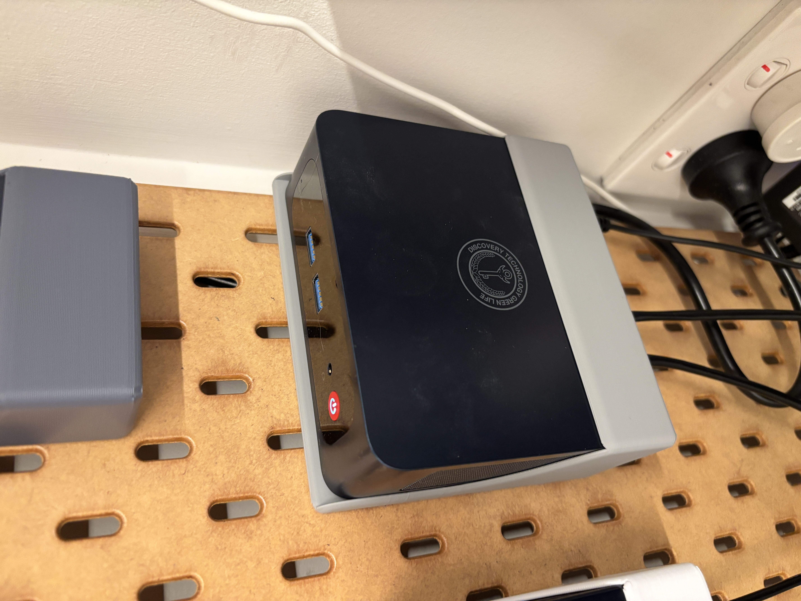

# 🖥️ Hardware

## Nodes

All nodes run an Intel N100 CPU, which is very low-powered; easy to purchase; and has Intel Quicksync for GPU tasks like Plex video encoding and Frigate ML object detection.

| Name   | IP Address     | Device               | CPU                | RAM  | nvme SSD     | SSD2   | Networking            | Use     | Purchased       |
| ------ | -------------- | -------------------- | ------------------ | ---- | ------------ | ------ | --------------------- | ------- | --------------- |
| pve    | 192.168.86.16  | Beelink Mini-S12 Pro | Intel N100         | 16gb | 512gb        | 1000gb | 1x 1gbps              | Primary | 30/04/24        |
| pve2   | 192.168.86.200 | TRIGKEY Green G5     | Intel N100         | 16gb | 512gb        | 2000gb | 2x 2.5gbps            | Backup  | 29/10/24        |
| nas    | 192.168.86.201 | MW-N100-NAS          | Intel N100         | 32gb | 1024gb       | 2000gb | 2x 2.5gbps, 1x 10gbps | NAS     | 26/12/24        |
| remote | Tailscale      | --                   | Intel Core i5-4570 | 16gb | 128gb (SATA) | --     | 1gbps                 | NAS     | a long time ago |

Beelink Mini-S12 Pro

TRIGKEY Green G5

NAS

## NAS
- 3x 16TB drive
- 1x 18TB drive
- 2x 2tb SSDs
- 1tb nvme drive (BOOT)

### PCIE passthroughs
- 06:00 - SATA controller for 5x of the ports
- 00:17 - Intel SATA controller for 1x of the ports (currently the right-most 16tb HDD)
- 05:00 - Aquantia 10g controller

## Networking

| Type    | Model                  | Purpose            |
| ------- | ---------------------- | ------------------ |
| Router  | Unifi UCG Ultra        |                    |
| Switch  | Unifi Enterprise-8-POE | POE + 2.5gbps      |
| Switch  | Unifi Flex Mini        | Entertainment Unit |
| Wifi AP | Unifi U7 Pro           | Living Room        |
| Wifi AP | Unifi U6 Lite          | Basement           |

## TODO
- [ ] Raspberry Pi 4B?
- [ ] Cool idea: https://www.reddit.com/r/homeassistant/comments/1i9esrn/docking_tablet_remote/