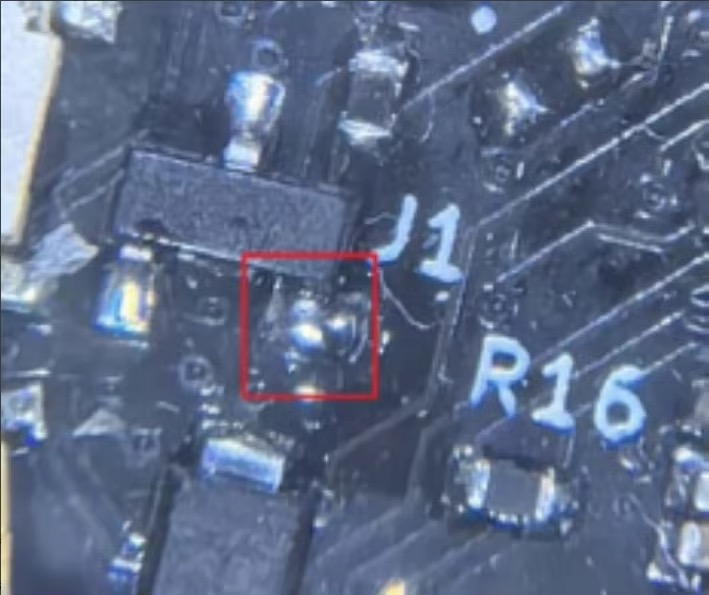
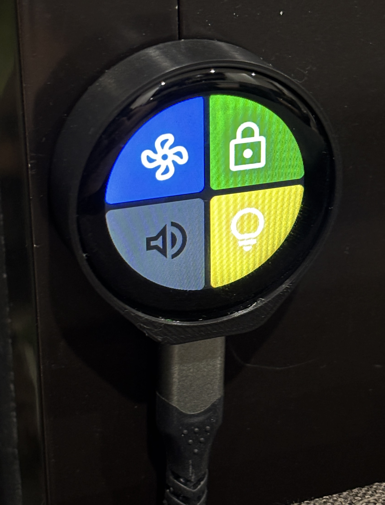
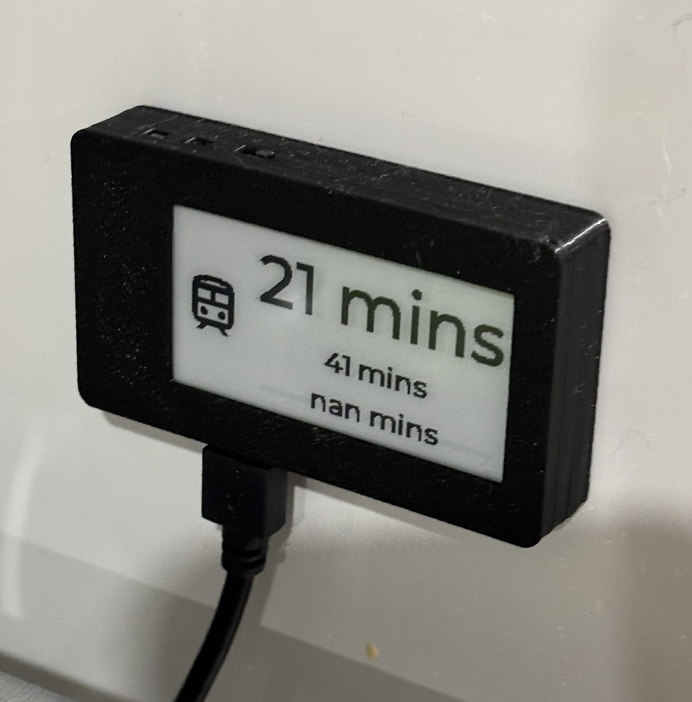

# 🟪 ESPHome

[ESPHome scripts repo](https://github.com/Samywamy10/esphome-scripts)

## Living Room Controls
On either side of the couch my partner and I often need to control a couple of different devices in the home. While we can control all of these via HomeKit to Home Assistant, sometimes your phone isn't on you or in an awkward position - or we have guests over who aren't in our HomeKit Home. For these cases I wanted an easy to use and conveniently accessible remote control for a few commonly used devices.

I designed and developed this screen for a 1.28" touch screen like [this one on Ali Express](https://www.aliexpress.com/item/1005005952879057.html?algo_pvid=2f89163d-82d7-43ea-a8b5-50c155c70cc0&algo_exp_id=2f89163d-82d7-43ea-a8b5-50c155c70cc0-0&pdp_npi=4@dis!AUD!19.98!12.39!!!13.38!8.30!@2140d2dc17248511797392848e0db9!12000035566548050!sea!AU!2612975283!X&curPageLogUid=K2GqyHuYsMWy&utparam-url=scene:search%7Cquery_from:), which is just $9 AUD at the moment 🤯.

Of note with this type of screen is there are three physical buttons on the right hand side. Pressing the middle button turns the screen on. The bottom button puts it into pairing mode.

To disable the need to press the middle button on power on to turn the screen on, you can jump/short the J1 jumper pad.



From the seller:
> The power switch button is in the off state by default when powered on. In this state, the battery can be charged and the serial port cannot be recognized. The ESP32, TFT screen, and TF card power supply are in the off state. Users can switch to the power on working state through the J1 jumper pad, and the button function will be disabled. The following picture is for reference by users after short circuiting.

Here's the screen in action:



I originally designed the screen to just adjust the AC as I wanted an easy way for guests to change the temperature.

I live in an apartment building and I'm able to control the intercom system from my phone (see project on Apartment building relays below). When I'm expecting guests they ring the video doorbell to come in - which I can see from the couch but I don't want to need to get up to unlock the door. So I wanted a way to unlock the door.

Controlling the volume of the TV via the Apple TV remote app is a painful exercise - basically one press of the volume up button on the phone corresponds to one volume step on the AV receiver. There's no easy to use software volume control in this app - so we end up using the AV receiver's app, but that's a pain to have to open. Plus using either app requires having your phone handy. So I wanted to have an easy to use volume control.

Finally, I used to have a movie mode automation where if the length of the content on TV was >1 hour it'd dim the lights as it assumed you were watching a movie. This mostly held true but you don't always want to dim all the lights and have a "cinema" like experience - sometimes you just want to casually watch something in the background. So I wanted controls for the lights for the cases where you want to get serious about movie watching.

Given both my requirements above and some past experience, I used the new [LVGL component in ESPHome](https://esphome.io/components/lvgl/). If you haven't used it before, LVGL is a graphics library, abstracting away a lot of the complexity of the traditional [Display component](https://esphome.io/components/display/#display-component) in rendering pixels in specific positions on the screen to a CSS-like interface.

[Using the shared ESPHome module I developed here](https://github.com/Samywamy10/esphome-scripts/blob/main/shared_living-room-controls.yaml), I programmed four buttons to show on the screen:
1. Air con controls: tapping on the fan icon turns the AC on if it's not already on, and then opens a page where the user can see both the current and target temperature; and change the target temperature or the mode (heat/cool). If the AC is on, it takes you to the same page to adjust the temperature; or the user can turn the AC off.
2. Lock controls: If the front door is locked, presses the intercom unlock button and unlocks the front door. If the front door is unlocked, locks the front door.
3. Volume controls: Tapping the icon opens another page which has a large arc around the edge to adjust the volume. At the moment it only applies the volume change upon release - need to look into how to make it respond more responsively without sending many values per second. On this page there's also a button to turn the TV off for when the PS5 turns off but the TV stays on
4. Light button: When the lights are on at 100%, dims them to 30%. When the lights are on at 30%, turns them off. When the lights are off, turns them on to 100%.

I've also set the display to dim relative to the light levels as measured by a presence sensor in the room.

I then 3D printed a case to hide the raw electronics of the ESP32 and screen internals, and to double-sided tape it to the wall.

Ideally they'd be battery powered but I think I've hidden the USB-C cables well.

As always there is room for improvement but these have already become super handy 😊.

## Apartment building relays

In the apartment building I live in we have an intercom system which allows someone to type in our apartment number at the building's front door and it rings the buzzer in our apartment so we can unlock the door for them.

But this also comes with a handy side benefit - we can unlock the door from inside our apartment. Which means if I press the right buttons, or have relays to simulate pressing the right buttons, I can unlock the door without needing to bring my key fob.

Originally I used a 4 channel Wifi enabled relay, and had each of the relays connected to the 3 different buttons on the intercom required to be pressed to unlock the door. I ran the cables using the pairs of an old ethernet cable through the wall from behind my entertainment unit where there's a power outlet, through to behind the wall of the intercom unit and into the unit itself. From here I soldered each of the pairs to either side of buttons on the circuit board.

This was then exposed to Home Assistant where I could create a script that presses the right sequence of buttons to unlock the door. I could then map that to a lock entity using this yaml:

```yaml
lock:
  - platform: template
    name: Apartment Building Door
    unique_id: apartment_building_door 
    value_template: "{{ is_state('binary_sensor.apartment_building_relays_is_unlocking', 'off') }}"
    lock:
      service: homeassistant.turn_on # dummy as nothing actually needs to happen here as this is more like a momentary press
    unlock:
      - service: button.press
        entity_id: button.apartment_building_relays_unlock_door
```

Eventually I moved this over to use an [ethernet ESP32 device from AliExpress](https://www.aliexpress.com/item/4000091488766.html?spm=a2g0o.order_list.order_list_main.43.69101802kwi8gN) (make sure to ask for the version with flashable firmware). I wanted to hard wire it as its pretty important that this always works so I can get into my house. I also wanted to [write my own firmware](https://github.com/Samywamy10/esphome-scripts/blob/main/apartment-building-relays.yaml) as it meant I could contain the button pressing logic to esphome itself, so Home Assistant can just tell the ESP32 to unlock and not need to worry about which buttons need to be pressed.

In future I also want to take a signal of the speaker as an analog input, so hopefully I can detect when the doorbell is rung programmatically and send a phone notification or something else. 

## Train timelines e-ink screen

I've always wanted to have an easy to see train timetable near the door. I know it always takes 5 minutes to walk to the train station, and so I wanted to be able to know how long I have until I need to leave.



I really like the look of e-ink or e-paper displays. Using the same technology as a Kindle screen, they look a lot less "techy" and more like a poster or some furniture.

So I combined these two concepts and programmed (also using [LVGL](https://esphome.io/components/lvgl/)) [a small eink display](https://www.aliexpress.com/item/1005003063164032.html) to show the next 3 train departures from my local train station.

Every minute Home Assistant calls the transport department's API to check live train departures, which I parse into 3 text input variables and then [display on the screen](https://github.com/Samywamy10/esphome-scripts/blob/main/eink.yaml).

Ideally this would be battery powered, particularly given e-inks impressive power draw characteristics - but at the moment I have it connected near to the coffee machine where there's a powerpoint. I'll probably revisit this in future as having technology be more invisible is hard if you need to run a power cable to the screen 😅.

This screen has been super helpful and I look at it pretty much every time I need to take the train. Its also supposed to show disruptions to the line - although I think I need to do some work on that.

## IR Sender for air con

I connected a Lolin S2 Mini ESP32 to an IR diode and then used the [Climate](https://esphome.io/components/climate/index.html) platform from ESPHome in [my script](https://github.com/Samywamy10/esphome-scripts/blob/main/irsender.yaml) to control my Hitachi air conditioner via the [`heatpumpir` platform](https://esphome.io/components/climate/climate_ir.html#arduino-heatpumpir) as the default Hitachi platform wasn't working for me.

Actually sourcing the IR diode was surprisingly difficult and I found it finicky to work with. I believe I used this [IR Transmitter from Jaycar](https://www.jaycar.com.au/duinotech-arduino-compatible-infrared-transmitter-module/p/XC4426) - note it takes a 5V input.

You want to make sure you're passing in a temperature sensor so the Climate entity produced by the ESPHome also reports the "current" temperature (in addition to the "target").

## Presences sensors/Bluetooth Proxies

Finally I have a number of Bluetooth proxies - both standalone devices as well as any device above which has Bluetooth. This has not only the benefit of extending the Bluetooth range of any device connected to Home Assistant (just the front door lock for now), but is also used with [Bermuda](https://github.com/agittins/bermuda) and my partner and I's Apple Watches to track which room we are in. I don't do anything with this information at the moment but hope to combine this with the mmwave presence sensors in each room to do different actions depends on who is in which room.