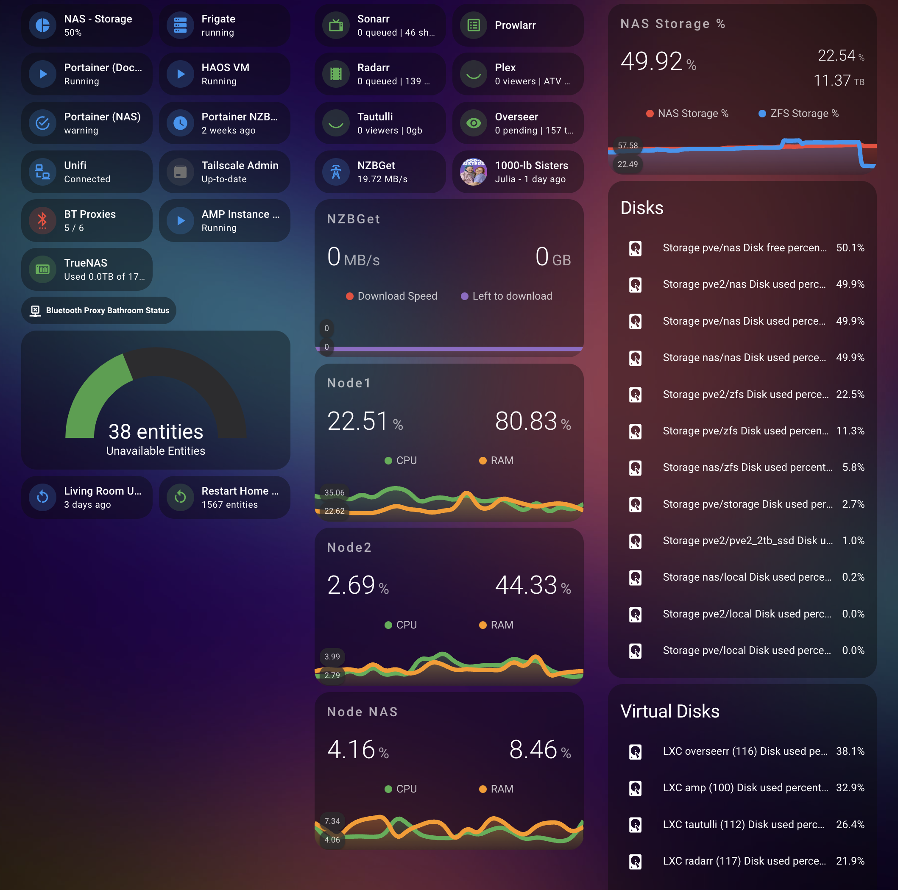
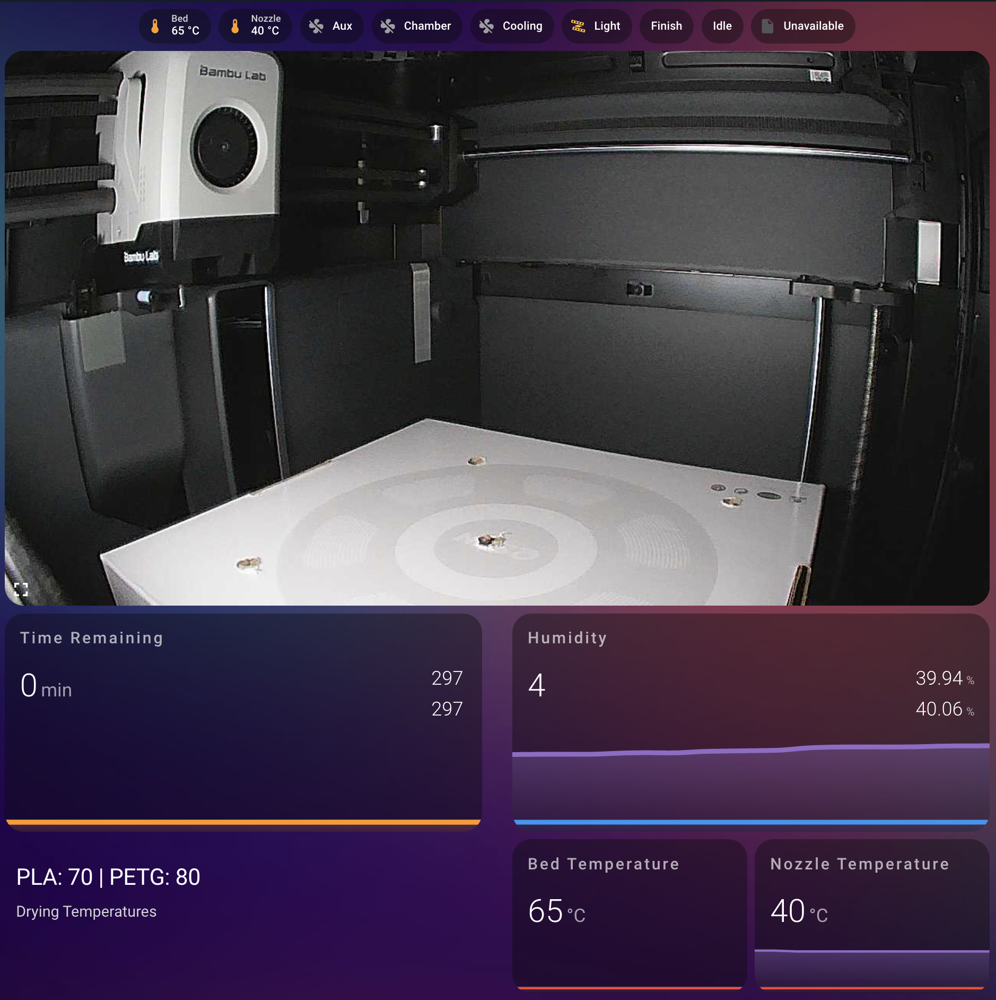

# 🟦 Home Assistant

[Home Assistant config repo](https://github.com/Samywamy10/homeassistant-config)

## Dashboards

In an ideal world you don't need any dashboards as the automations should either take action or notify you of abnormal states. Regardless, a nice looking dashboard is satisfying to make, look at, and monitoring how your systems are performing.

### Homelab

The main dashboard I access is the Homelab dashboard. I mostly use [Mushroom cards](https://github.com/piitaya/lovelace-mushroom) for single values, and the [mini-graph-card](https://github.com/kalkih/mini-graph-card) for any graphs.

The reason I created this dashboard and the primary use case is as a "homepage" for other services. As the number of services I hosted increased, I found it increasingly difficult to remember the IP addresses. There are solutions that map a proper domain name to an IP address, eg:
- setting a Unifi local DNS record
- installing [Tailscale and using Magic DNS](https://tailscale.com/kb/1081/magicdns)
- using [Cloudflare Tunnels](https://developers.cloudflare.com/cloudflare-one/connections/connect-networks/)

However I settled on a page of bookmarks as this could display other interesting information. There are also apps specifically for this purpose like [Homarr](https://homarr.dev/) or [Homepage](https://gethomepage.dev/) but I was both already familiar with Home Assistant and it already contained heaps of data about my home setup.

**Homelab Dashboard**

I've split the page into three columns, broadly:
1. General services
2. *Arr Stack and Nodes
3. Storage and hard drives

I've tried to get each of the cards to show some meaningful status about the service it displays. Clicking on each card takes you to the Web UI of the given app, which in [Arc](https://arc.net/) opens a new temporary overlay window which is useful.

I also wanted to provide some quick actions for troubleshooting:
- Number of offline Home Assistant entities (colour coded showing acceptable ranges)
- Restart button for Unifi U7-Pro router (was having a lot of issues with it)
- Restart button for Home Assistant itself

There are a number of [auto entities cards](https://github.com/thomasloven/lovelace-auto-entities) to show information when relevant:
- Bluetooth proxy device statuses
- Active Plex clients
- Proxmox physical disks
- Proxmox virtual disks

### 3D Printer

3D Printer Dashboard

The 3D printer dashboard works with the [`ha-bambulab` Integration](https://github.com/greghesp/ha-bambulab) and my BambuLab P1S 3D printer, and allows me to check status and time remaining of active prints. I can also control some settings like fans and the light.

Unfortunately if you connect to your printer via the cloud (which is required for using the useful Bambu Handy app), you can't set bed or nozzle temperatures from Home Assistant. This'd be handy to set up the right bed temperature and fan for [filament drying](https://wiki.bambulab.com/en/general/bambu-filament-drying-cover).

## Automations

### Notifications
- Dishwasher or Washing Machine has finished (Calculated when power draw drops below threshold)
- Dehumidifer is full (Calculated when power draw drops below threshold)
- Requested content from Overseerr is now available in Plex (Overseerr calls HA webhook)
- Front Door is unavailable (When Bluetooth or the lock itself are offline)

### Presence
- Bathroom Presence turns on lights, fan and rotates PTZ cat camera to face wall
- Office Presence turns on lights
- Bedroom Presence turns on lights when not in Sleep Time

### Switches
- Handles button presses from the LIFX Switches in each room
- Flic button next to bed turns off all lights on single press; and turns on fan on double press. Flic button is integrated by sending an Internet Request, which I make hit a webhook URL which is a Home Assistant automation trigger. Make sure these are both set to the same request type eg GET
- Philips Hue Dial actions (change TV volume, turn on lights, turn on TV, open intercom)

### Other
- Show 3D print time remaining on [Lametric Time](https://lametric.com/en-AU) screen
- Request live train departure times for my closest train station every 1 minute and put into a text variable
- Turn on 🌴 Holiday Mode to disable all automations tagged with `Disbale on Holiday`
- Populate "Unavailable Entities"

## Hardware recommendations

Should this go in hardware section?

# Tips and tricks
## Escape out of the HAOS console
Run `login`

## Running out of space?
Go to the Console of the HAOS VM in Proxmox, and type `login` to escape out of the HAOS CLI. Then run `du -sh */` to see the size of each folder in the current directory. Keep navigating down to find the biggest folders.

### Common culprits
- `/mnt/data/supervisor/addons/data` -> esphome build cache. Can clean up by going to esphome device builder addon, clicking on a device's 3 dots and "Clean build files"
- `/mnt/data/supervisor/backup` -> nothing to clean up here
- `/mnt/data/supervisor/homeassistant` -> can delete any "corrupt" files

### Identify broken automations etc.
Use [Spook](https://spook.boo/)

## Custom integrations

- [ ] CubeCoders AMP
- [ ] VicEmergency