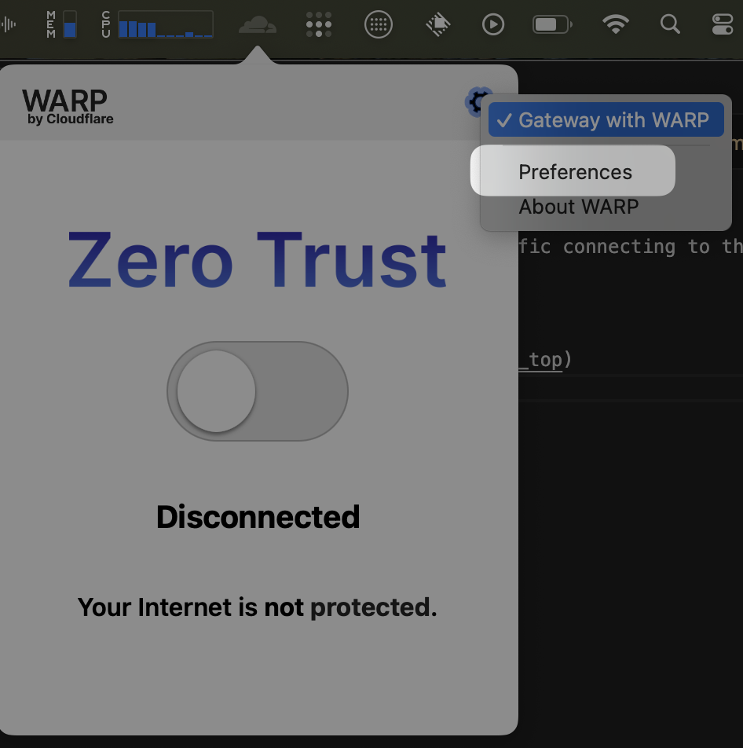
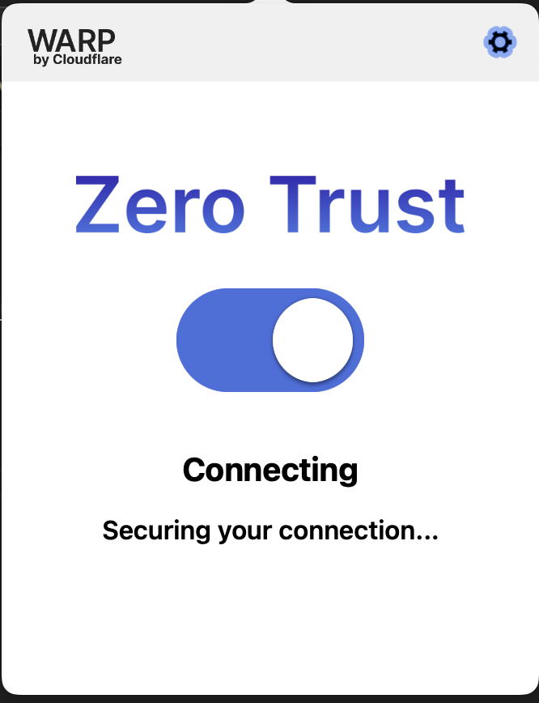
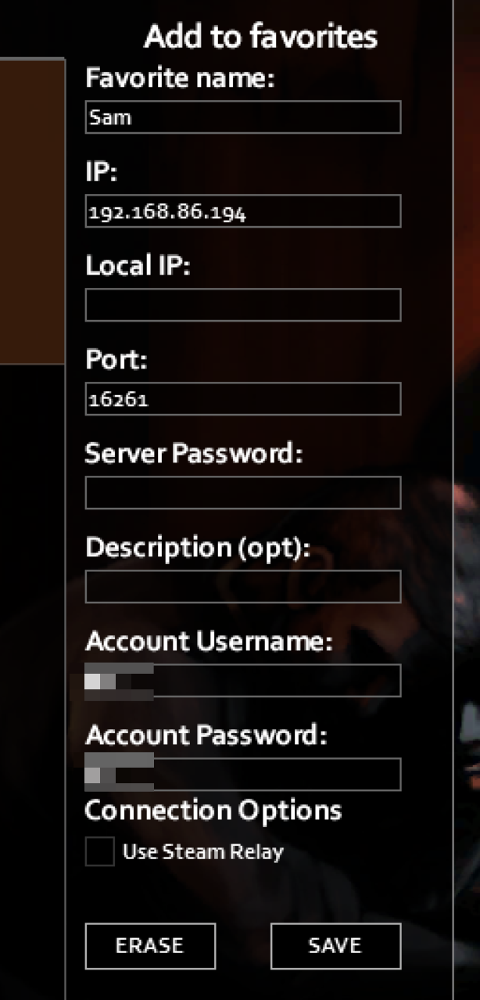

# Joining the Zomboid server
To connect to the Zomboid server you'll need to connect to our private network. This is facilitated by Cloudflare WARP which will send traffic connecting to the Zomboid IP Address is on through to our remote server. The rest of your traffic will connect to your internet as normal.

## Steps
1. Download and install [Cloudflare WARP](https://developers.cloudflare.com/cloudflare-one/connections/connect-devices/warp/download-warp/#_top)
2. Open Cloudflare WARP preferences

3. Click on the "Account" tab and log in
4. In the team name, input `samjwright.com`
5. In the tab that opens, type your pre-approved email address in.
6. You'll receive a one-time code email. Paste that in and log in.
7. Make sure WARP is turned on

1. In Zomboid, click `Join` in the menu and add a server with:
   - **Favorite name:** Whatever you wan to call the server
   - **IP address:** `192.168.86.194`.
   - **Port:** `16262` (this is the default)
   - **Account username:** Make something up
   - **Account password:** Make something up
   - Leave all other settings as default

## Adding a new user (admins only)
Add user [here](https://one.dash.cloudflare.com/edb928b250efc2c8f364a49935869efb/access/apps/rules/94c21dd7-550f-40a0-bb3e-0aa475fbf22c/181fdeab-0e93-4802-a200-23968072be10)